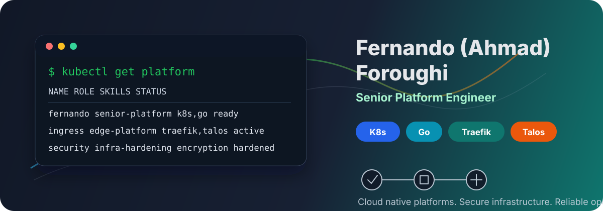

  

<h1 align="center">Fernando (Ahmad) Foroughi</h1>

  Senior Platform Engineer | Kubernetes | Go | Open-Source Contributor

  <a href="https://pyhp2017.github.io/">Website</a> ·
  <a href="https://www.linkedin.com/in/ahmad-foroughi">LinkedIn</a> ·
  <a href="mailto:pyhp2017@gmail.com">Email</a>

---

### :man_technologist: What I Do

- Senior Platform Engineer focused on Kubernetes, platform reliability, and production infrastructure.
- Mostly working with Kubernetes and Go these days.
- Building and operating systems with Traefik, Talos Linux, Docker, Linux, Terraform, Ansible, and disk encryption.
- Using Claude and Codex as part of my daily engineering workflow.
- Contributing to open-source projects around package registries, observability, distributed systems, and infrastructure tooling.

---

### :hammer_and_wrench: Technologies & Tools

  
  
  
  
  
  
  
  
  
  
  
  
  
  
  

---

### :sparkles: Open-Source Contributions

- [Verdaccio v6.4.0](https://github.com/verdaccio/verdaccio/releases/tag/v6.4.0): contributed to the package filter plugin work included in the release.
- [getsentry/snuba #6826](https://github.com/getsentry/snuba/pull/6826): proposed migration robustness improvements for multi-replica and multi-shard ClickHouse clusters.
- [kommodity-io/kommodity #288](https://github.com/kommodity-io/kommodity/pull/288): contributed to the Kommodity project.

---

### 🚀 Featured Projects

- [**Microservice Application - Sigasi Internship**](https://www.sigasi.com/online/): Designed and implemented a microservice application during my internship at Sigasi.
- [**Simple Kubernetes Controller**](https://github.com/pyhp2017/simple-kubernetes-controller): Developed a simple Kubernetes controller for specific use cases.
- [**Zero Trust Network Architecture**](https://github.com/pyhp2017/zero-trust-network-kntu-master): Implemented a Zero Trust architecture using Elastic SIEM, Keycloak, Docker/Kubernetes, attack simulation, and security dashboards.
- [**Telegram Text Browser Bot**](https://github.com/pyhp2017/telegram-browser-project): Built a Telegram bot for browsing and searching the web as clean plain text with link navigation and pagination.
- [**Scandiweb Stack**](https://github.com/pyhp2017/scandiweb-stack): Infrastructure to host Magento 2 application on AWS. Easy to install and manage.
- [**Requesto**](https://github.com/pyhp2017/Requesto): Monitoring tool for HTTP endpoints, built with Python and Django Rest Framework.
- [**Django OpenVPN Maker**](https://github.com/pyhp2017/Django-OpenVpn-Maker): A web interface built with Django for managing OpenVPN users using the Docker OpenVPN repository.
- [**TCP Monitor**](https://github.com/pyhp2017/tcp_monitor_golang): A simple tool that collects TCP packets for Prometheus, acting as an exporter.
- [**Tank Trouble**](https://github.com/pyhp2017/Tank-Trouble): A fun multiplayer game where players compete with AI or friends in tank battles.
- [**LinuxFest Website Backend**](https://github.com/pyhp2017/LinuxFest-Website-backend): Backend for the LinuxFest website.
- [**ReserveRoom**](https://github.com/pyhp2017/ReserveRoom): API-based web application for meeting room reservations.
- [**Blog CMS**](https://github.com/pyhp2017/Blog-CMS): A CMS for managing digital content, perfect for enterprise and web content management.

---

### :muscle: Skills

- 
- 
- 
- 
- 
- 
- 
- 

---

### 👨🏻‍💻 About Me

- :hourglass_flowing_sand: Working on Kubernetes platforms, Go services, infrastructure automation, and secure Linux systems.
- :rocket: Open to collaboration on platform engineering, cloud-native, observability, and open-source infrastructure projects.
- :dart: Life Motto: "Focus on progress, not perfection."

---

### :heart: Let's Connect!

- Website: [pyhp2017.github.io](https://pyhp2017.github.io/)
- Email: [pyhp2017@gmail.com](mailto:pyhp2017@gmail.com)
- LinkedIn: [LinkedIn Profile](https://www.linkedin.com/in/ahmad-foroughi)
